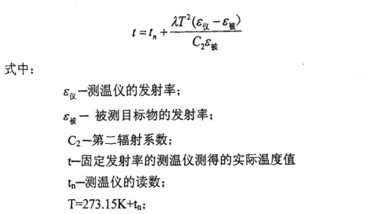

# 红外测温功能开发
## 一、标定
### 1.在`main.py`中更改mode
```
mode = "TemperatureCalibration"
```
### 2.运行`Calibration_DataProcessing.py`
`input_folder`下的文件结构如下：
```
input_folder
--32.txt
--34.txt
--36.txt
```
运行结束后会将中心裁剪后的图像即excel文件保存至`output_folder`中
### 3.在`main.py`中更改参数excel_path
### 4.根据标定温度数量在`train.py`中调参
#### 4.1调整batch_size
```
train_loader = Data.DataLoader(dataset=train_data, batch_size=32, shuffle=True)
```
#### 4.2调整学习率
```
optimizer = torch.optim.Adam(model.parameters(), lr=0.001)
```
#### 4.3调整迭代次数
```
for epoch in range(300):
```
### 5.在`main.py`中更改model_name
>[!IMPORTANT]
>运行前一定要及时修改，以防覆盖之前训练好的模型参数
### 6.运行`main.py`
## 二、测温
### 1.在`main.py`中更改mode
```
mode = "TemperaturePredictor"
```
### 2.加载14bit图像数据集`data_dir`和8bit图像数据集`image_dir`
待测温图像数据集文件结构如下：
```
data_dir
  2025-03-26-18_52_41_1号.txt
  2025-03-26-18_53_41_1号.txt
image_dir
  2025-03-26-18_52_41_1号.png
  2025-03-26-18_53_41_1号.png
```
>[!IMPORTANT]
>确保两个文件夹中文件名一一对应，否则无法调出图片进行交互式测温
### 3.在`main.py`中进行发射率校正
校正函数[^1]参考公式如下：\
\
[^1]:陆子凤.红外热像仪的辐射定标和测温误差分析[D].中国科学院研究生院（长春光学精密机械与物理研究所）,2010.
#### 3.1开启发射率校正
```
is_emissivity_correction=True
```
#### 3.2修改发射率校准参数
相机中心波长为10微米，发射率为0.95，一般不需要修改，因此主要修改被测物体的发射率：
```
epsilon_obj=0.95
```
### 4.在`main.py`中进行工作时间校正
通过运行`工作时间vs灰度.py`，得到相机增益随工作时间的变化规律见`工作时间vs灰度.opju`
#### 4.1开启工作时间校正
```
is_time_correction=True
```
#### 4.2创建output_folder，用于存储校正后的图像，后续测温操作用output_folder和image_dir中的文件进行
>[!NOTE]
>相机充分预热（如预热40min）后进行标定和测温则不需要进行工作时间校正，否则校正函数会带来较大的测量误差
### 5.运行`main.py`
在交互式测温窗口，鼠标左键单击测温点显示温度，空格键切换下一张待测温图片
